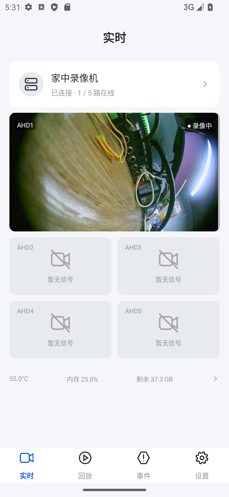
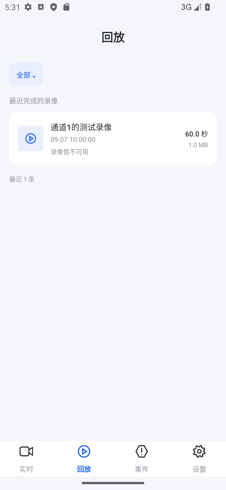
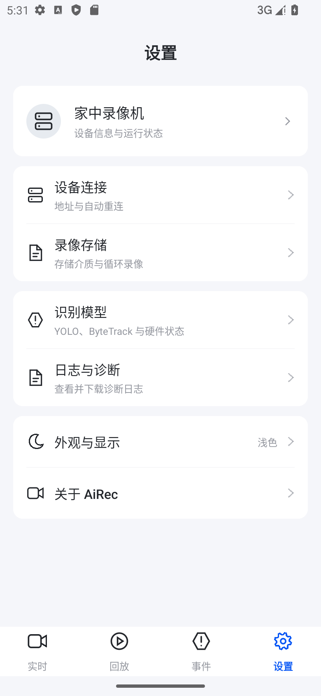

# AiRec 安卓客户端

在手机上查看录像机画面、回看录像和管理摄像头。支持 **Android 12 及以上版本**，适配横竖屏，提供浅色和深色界面。

## 界面预览

| 实时画面                                                         | 录像列表                                                               | 设备设置                                                             |
| ------------------------------------------------------------ | ------------------------------------------------------------------ | ---------------------------------------------------------------- |
|  |  |  |

以上截图来自新版应用的模拟器测试，使用无人物测试画面。

## 主要功能

- 同时查看五路摄像头。
- 上下滑动通道时间轴，回放指定日期的录像。
- 按人、车、动物和长时间停留筛选事件。
- 查看设备状态、调整通道设置、下载录像和诊断日志。
- 修改录像机地址，断网后自动重连。

## 安装与运行

本应用需要配合 **AiRec-Rec（Ubuntu）或 AiRec-Host-Android（安卓主机）**使用。

1. 安装 Android Studio，用它打开本仓库文件夹。
2. 在 SDK Manager 安装 **Android SDK 36** 和 **Build Tools 36.0.0**，等待工程同步完成。首次构建需要联网。
3. 连接开启 USB 调试的手机，或启动 Android 12 以上的模拟器，点击运行按钮。

也可以在本仓库文件夹打开 Windows PowerShell，生成安装包：

```powershell
.\build-apk.ps1
```

脚本会运行测试并构建 APK。完成后，将 `dist/` 中的 `*-debug.apk` 复制到手机，按系统提示允许安装即可。该文件是调试安装包，正式发布需要自己的发布签名。

## 连接录像机

让手机与录像机处于同一局域网，在应用设置中填写录像机地址，例如：

```text
http://192.168.10.209:8080
```

请换成你自己的录像机 IP。可以先在手机浏览器打开该地址，确认服务能够访问。没有接摄像头的通道不会影响其他通道使用。

## 更多说明

- [文档导航](docs/README.md)

- [接口说明](docs/CLIENT_API.md)

- [测试记录](VERIFICATION.md)

源码在 `app/src/`，安装包和构建日志在 `dist/`。本机配置、缓存和签名文件已设置为不提交到 Git。
